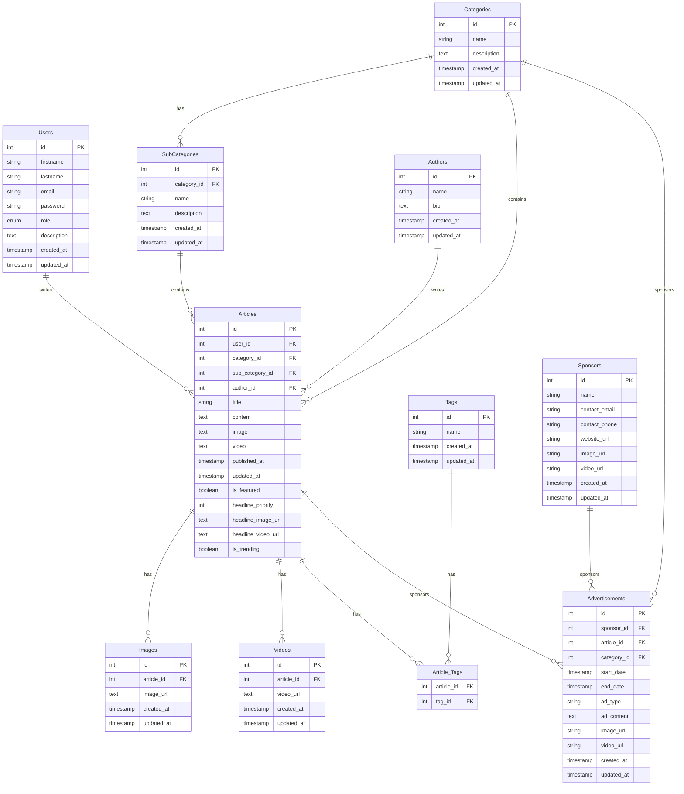

## Database Schema Overview

This diagram shows the relationships between all tables in the database:

1. **Users**: Core user management table
2. **Categories**: Main content categories
3. **SubCategories**: Sub-categories related to main categories
4. **Articles**: Main content table with relationships to categories and authors
5. **Authors**: Content creators information
6. **Images**: Article-related images
7. **Videos**: Article-related videos
8. **Tags**: Content tagging system
9. **Article_Tags**: Many-to-many relationship between articles and tags
10. **Sponsors**: Advertisement sponsors information
11. **Advertisements**: Advertisement management

### Key Relationships:

- Articles belong to Users (who write them)
- Articles belong to Categories and SubCategories
- Articles can have multiple Images and Videos
- Articles can have multiple Tags through Article_Tags
- Articles can be associated with Advertisements
- Categories can have multiple SubCategories
- Sponsors can have multiple Advertisements
- Articles can be associated with Authors (optional)

### Foreign Key Behaviors:

- User deletion cascades to their Articles
- Category/SubCategory deletion sets NULL in Articles
- Author deletion sets NULL in Articles
- Article deletion cascades to Images, Videos, and Article_Tags
- Sponsor deletion cascades to Advertisements
- Article/Category deletion cascades to Advertisements
